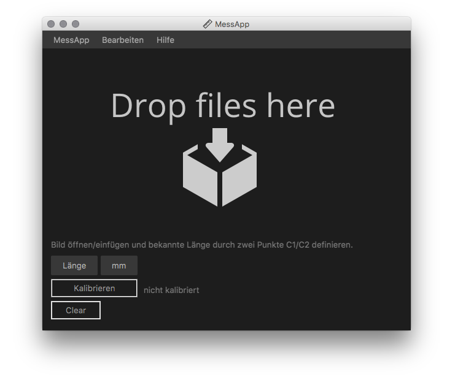

# MessApp

**MessApp** is a JavaFX application for carrying out measurements in images that contain a known dimension, e.g. a scale marker or an object with a known size. 

It allows images to be copy/pasted, drag/dropped or opened by file open dialog. 

Image size follows windows size.

After loading the image enter value and unit of your known distance (e.g. scale marker) and click on both of it's boundaries to define it..
Then klick "Kalibrieren".

Once calibrated multiple measurements can be made.

Intended use is for technicians, modellers and everyone who wants to take measure from drawings or photos.
